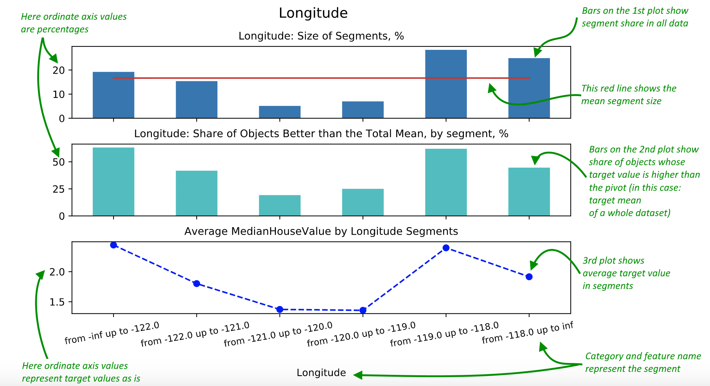

[](LICENSE)
[](https://img.shields.io/badge/Python-3.7%2B-blue)
[](https://img.shields.io/badge/version-0.2-blue)

# Info
**Data Fast Insights** is a library for quickly finding insights on given data or testing hypotheses.  
Thus it can be used:
 - to test how any features from a given set (as well as their combinations) affect target variable 
 and **find those which require attention and change the most**  
 - to test if a defined hypotheses is true or not 

[What does the library calculate and how?](doc/CALCULATIONS_DESCRIPTION.md)

# Installation  
Installation instructions can be found [here](doc/INSTALL.md).

# User guide
:warning: Please read a [user guide](doc/USER_GUIDE.md) before using the library, 
it contains important notes about data preparation.

# Documentation  
- Most functions have docstring and type hints describing its arguments and output.   
- Columns of resulting dataframes are also described in corresponding docstrings.    
- [doc](doc/) directory contains useful documentation on distinct parts of the library (they are noted in this README as well)  

# Quickstart
Let's look at the short example which uses core features of the library and outputs the report.  
  
Importing all the required methods and classes.
```python
import pandas as pd
from sklearn import datasets

from data_fast_insights import BinaryDependenceModelData
import data_fast_insights.calculations as calc
from data_fast_insights.plotting import plot_segments_basic_info
```   
The following line is for better plot display in Jupyter Notebook.
```python
%config InlineBackend.figure_format = 'svg'
```
#### Setting the data
Let's analyze data the 
[California Housing Dataset](https://scikit-learn.org/stable/datasets/real_world.html#california-housing-dataset),
for which the target variable is the median house value of a block for California districts.
        
```python
raw_data = datasets.fetch_california_housing()
df = pd.DataFrame(raw_data['data'], columns=raw_data['feature_names'])
df['MedianHouseValue'] = raw_data['target']
```
We're defining the main data object that will further
be used for calculations. Here we're adding our data and telling the library how to use it.
```python
dmd = BinaryDependenceModelData(
    base_data=df,
    cat_cols=None,
    num_cols={'MedInc', 'HouseAge', 'AveRooms', 'AveBedrms', 'Population', 'AveOccup', 'Latitude', 'Longitude'},
    y_name='MedianHouseValue',
    y_quantile=0.5)
```

#### Calculating the metrics
In the following lines we're converting all data to binary format, which model uses to calculate metrics.
```python
num_bins = calc.make_bins(model_data=dmd)

dmd.convert_to_binary(bins=num_bins)
```
Finally we're calculating these metrics
```python
res = calc.calculate_dependence(model_data=dmd)
```

#### Analyzing the results
Let's look at 3 most important segments (highest `low_perc`), only including those which make up at least 5% of data 
```python
print(res[res['perc_of_total'] > 5][:3][['low_perc', 'base_col']])
```
``` 
# Output:
                            low_perc   base_col
AveOccup_[4.0,inf)         84.057143   AveOccup
Longitude_[-121.0,-120.0)  80.776515  Longitude
MedInc_[-inf,3.0)          80.543109     MedInc
```
Now we can look at corresponding `base_col` in order to plot reports for features these segments are from.  

#### Plotting reports for distinct features  
Let's take a look at second most important segment, `Longitude_[-121.0,-120.0)`, 
for which the base column is `Longitude` (house block longitude):

```python
f = plot_segments_basic_info(
    model_data=dmd, res_low_df=res, base_feature_name='Longitude')
plt.show()  # not required in Notebooks
```
Here we have multiple plots describing Longitude feature.  
_Green text and arrows are comments_
  

#### Observations 
2nd and 3rd plots show that there is a **significant drop of house value in blocks 
located at Longitude from -121 up to -119** (not including -119), which requires further research.

# Other examples  
- [Quickstart example in the Jupyter Notebook format](examples/housing_dataset_example.ipynb)
- **More verbose example on synthetic data** with comments on code and its output can be found 
[here](doc/VERBOSE_EXAMPLE.md).  
- [Other examples](examples/) (IPython notebooks and python scripts)  

# Other features
Features not used in examples are described [here](doc/OTHER_FEATURES.md)

# Changelog
You can find the version history [here](CHANGELOG.md).

# To be done  

#### Backlog (top priority features)
- Renaming, deleting, adding features inside the model
- Improving overall report interpretability
- Adding new metrics
- Adding estimated effect of changing segments to report (now it's in a distinct dataframe only)
- Adding tests
- Describing and improving additional and experimental features (such as split-apply-combine experiment type)
- Improving support of combined features in plotting 
- Automatic result from just SQL that generates features and target